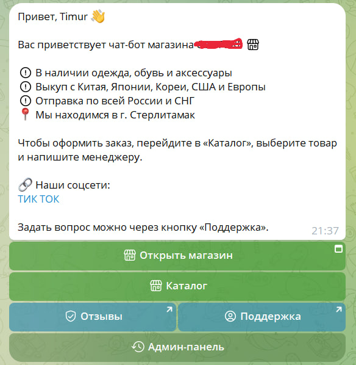
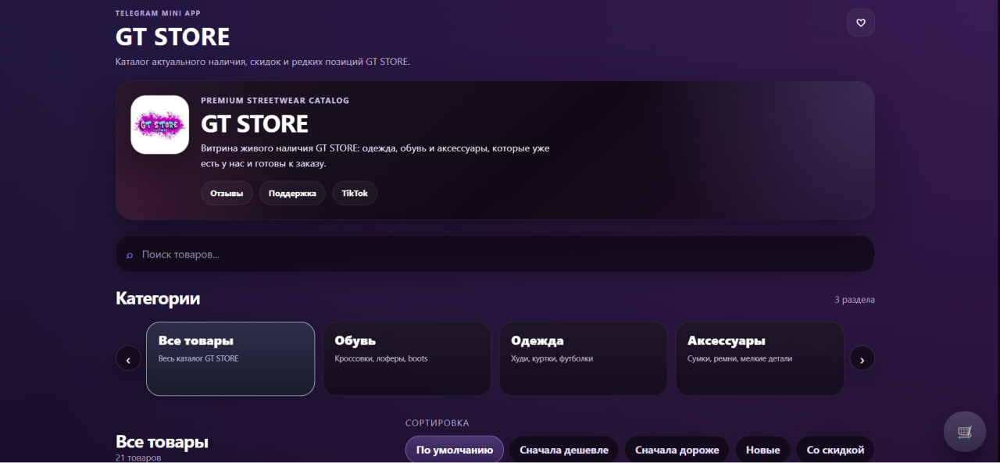

# Telegram Store Manager

<div align="center">


## Telegram Bot + Mini App For Fashion Stores

**Готовая система для Telegram-магазина: каталог, админка, канал, скидки, импорт постов, Mini App, корзина и заказы.**

[](https://www.python.org/)
[](https://aiogram.dev/)
[](https://www.postgresql.org/)
[](https://www.docker.com/)
[](LICENSE)

[Возможности](#-возможности) ·
[Mini App](#-telegram-mini-app) ·
[Запуск](#-запуск-через-docker) ·
[Контакт](#-автор-и-связь)

</div>

**Telegram Store Manager** - это шаблон production-ready Telegram-магазина для одежды, обуви и аксессуаров.  
Он закрывает два интерфейса сразу: бот для покупателей и админов, плюс мобильный Mini App-каталог внутри Telegram.

Проект не привязан к конкретному магазину. Название, ссылки, аватарку, домен, тексты, цвета и оформление можно заменить под свой бренд.

> В репозитории нет реальных токенов, паролей, ID админов, IP сервера, доменов и приватных ссылок. Всё рабочее хранится только в локальном `.env`.

## Быстрая Сводка

| Часть системы | Что внутри |
| --- | --- |
| 🛍 Покупательский бот | Главное меню, каталог, категории, отзывы, поддержка, Mini App-кнопка. |
| 🛠 Админ-панель | Добавление товаров, импорт из канала, активные объявления, проданные товары. |
| 🧾 Товары | 1-5 фото, название, размер, состояние, описание, цена, скидка, статус. |
| 📣 Telegram-канал | Автопубликация постов, альбомы, SOLD-обновления, premium emoji, HTML. |
| 🔁 Импорт | Перенос уже опубликованных постов из канала в каталог бота. |
| 🔥 Скидки | Старая цена зачёркивается, новая цена становится актуальной. |
| ✅ SOLD | Товар скрывается из каталога и попадает в раздел проданных. |
| 📱 Mini App | Поиск, категории, сортировка, карточки, избранное, корзина, оформление заказа. |
| 🧠 Backend API | FastAPI endpoints для товаров, категорий, фото, заказов и Telegram WebApp validate. |
| 🐳 Deploy | Docker Compose, PostgreSQL, Redis, Caddy, Alembic migrations. |

## Скриншоты

### Главное меню бота



### Telegram Mini App



## ✨ Возможности

| 🛒 Каталог и товары | ⚙️ Администрирование |
| --- | --- |
| Категории: обувь, одежда, аксессуары | Админка прямо в Telegram |
| Карточки с фото, ценой, размером и состоянием | Доступ только по `ADMIN_IDS` |
| Поддержка 1-5 фото на товар | FSM-сценарии без хаоса в сообщениях |
| Пустые категории обрабатываются отдельным сообщением | Логи действий админа в базе |
| Кнопка связи с менеджером | Навигация назад по разделам |

| 📣 Канал и импорт | 📱 Mini App |
| --- | --- |
| Публикация товара в Telegram-канал | Мобильная витрина внутри Telegram |
| 1 фото через `sendPhoto` | Поиск по названию, описанию и категории |
| 2-5 фото через `sendMediaGroup` | Сортировка по цене, новизне и скидкам |
| Caption только на первом фото альбома | Избранное в `localStorage` |
| Импорт постов из канала в каталог | Корзина и оформление заказа |

| 🔥 Скидки и статусы | 🧩 Инфраструктура |
| --- | --- |
| Старая цена хранится в `old_price` | PostgreSQL + SQLAlchemy 2.x |
| Новая цена должна быть меньше текущей | Alembic migrations |
| Можно удалить скидку и вернуть старую цену | Redis FSM storage |
| SOLD скрывает товар из каталога | Structured logging |
| Проданные товары можно архивировать | Docker Compose + Caddy |

## Как Работает Бот

Бот управляет товарами магазина и показывает каталог покупателям.

Админ открывает панель командой:

```text
/admin
```

Если пользователь не входит в `ADMIN_IDS`, бот не даст доступ к админке.

### Главное меню

Покупателю доступны:

- `Каталог` - товары по категориям;
- `Отзывы` - ссылка на канал или чат отзывов;
- `Поддержка` - ссылка на менеджера;
- `Открыть магазин` - запуск Mini App;
- `Админ-панель` - только для админов.

Категории фиксированные:

- `Обувь`
- `Одежда`
- `Аксессуары`

## Админ-Панель

В админке есть:

- `Добавить новый товар`
- `Импорт из канала`
- `Активные объявления`
- `Проданные товары`
- `Назад`

Все сценарии сделаны пошагово через FSM. Админ не заполняет огромную форму сразу: бот спрашивает данные по очереди.

## Добавление Товара

Сценарий добавления:

1. Админ отправляет от 1 до 5 фото.
2. Вводит название.
3. Вводит размер.
4. Вводит цену.
5. Вводит состояние.
6. Вводит описание.
7. Выбирает категорию кнопкой.

Если описание не нужно:

```text
0
```

После заполнения бот показывает предпросмотр и кнопки:

- `Опубликовать в канал и бот`
- `Добавить только в бот`
- `Изменить`
- `Отмена`

`Опубликовать в канал и бот` сохраняет товар в базу, добавляет его в каталог и публикует пост в канал.

`Добавить только в бот` сохраняет товар в базу и показывает его в каталоге, но не отправляет пост в канал.

## Фото И Канал

Правила простые:

- 1 фото - `sendPhoto`;
- 2-5 фото - `sendMediaGroup`;
- caption только у первого фото;
- file_id всех фото сохраняются в БД;
- ID первого сообщения канала сохраняется для будущего редактирования.

Если товар добавлен только в бот, у него нет `channel_message_id`. При скидке или SOLD бот обновляет только базу и карточки, не трогая канал.

## Импорт Из Канала

Импорт нужен, когда товар уже опубликован вручную в Telegram-канале.

Как работает:

1. Админ нажимает `Импорт из канала`.
2. Бот просит переслать пост.
3. Админ пересылает сообщение или все сообщения альбома.
4. Бот собирает фото и текст.
5. Пытается распарсить название, размер, состояние, цену, статус и категорию.
6. Если данных не хватает, спрашивает их вручную.

После импорта товар появляется в каталоге бота.

Telegram entities, HTML-разметка, ссылки, hashtags и premium emoji сохраняются настолько близко к оригиналу, насколько это позволяет Bot API.

## Скидки

Кнопка `Сделать скидку` просит новую цену.

Условия:

- цена должна быть числом;
- новая цена должна быть меньше текущей;
- старая цена переезжает в `old_price`;
- новая цена становится актуальной.

Отображение:

```html
Цена: <s>20000 ₽</s> 15000 ₽
```

Если товар связан с постом в канале, caption обновляется. Если товар только в боте, меняется только база и интерфейс.

## Удаление Скидки

Если у товара уже есть скидка, появляется `Удалить скидку`.

Кнопка:

- возвращает старую цену;
- очищает `old_price`;
- убирает зачёркивание;
- обновляет канал, если есть связанный пост.

## SOLD И Проданные Товары

`Товар продан` переводит товар в `SOLD`.

После этого:

- товар исчезает из пользовательского каталога;
- появляется в разделе `Проданные товары`;
- канал обновляется, если пост был опубликован ботом;
- Mini App получает актуальный статус из API.

`Удалить из списка` в проданных товарах не удаляет запись из базы. Оно ставит `archived_at`, чтобы скрыть товар из интерфейса и сохранить историю.

## Premium Emoji

Premium emoji лежат в:

```text
app/utils/premium_emoji.py
```

В тексте используется Telegram HTML:

```html
<tg-emoji emoji-id="5206607081334906820"></tg-emoji>
```

В кнопках используется отдельное поле:

```python
icon_custom_emoji_id="5206607081334906820"
```

HTML внутри текста кнопки не используется.

## 📱 Telegram Mini App

Mini App - это витрина магазина внутри Telegram.

Внутри:

- тёмный адаптивный интерфейс;
- шапка магазина;
- аватарка/логотип;
- поиск;
- категории;
- сортировка;
- карточки товаров;
- избранное;
- корзина;
- оформление заказа;
- уведомление админам в Telegram.

Mini App использует ту же базу, что и бот. Добавили товар в админке - он появился на сайте. Поставили скидку - цена обновилась. Отметили SOLD - статус изменился.

### Что можно поменять

- название магазина;
- описание в шапке;
- аватарку;
- цвета;
- тексты кнопок;
- ссылки на отзывы, поддержку и соцсети;
- поля формы заказа;
- отображение проданных товаров;
- домен Mini App.

Аватарку удобно положить сюда:

```text
frontend/public/store-avatar.jpg
```

И подключить в:

```text
frontend/src/components/HeaderBanner.tsx
```

Для публичного репозитория личные логотипы лучше не коммитить. Для приватного проекта можно хранить их в `frontend/public/`.

## Заказы

Покупатель добавляет товары в корзину и отправляет заказ.

Форма может содержать:

- имя;
- Telegram username;
- телефон для связи;
- комментарий.

После отправки:

- backend создаёт заказ в базе;
- бот отправляет уведомление админам;
- в сообщении есть товары, количество, сумма и контактные данные.

## Backend API

FastAPI backend находится в:

```text
app/web/
```

Endpoints:

- `GET /api/health` - health check;
- `GET /api/products` - список товаров;
- `GET /api/products/{id}` - один товар;
- `GET /api/categories` - категории;
- `GET /api/meta` - данные витрины;
- `POST /api/webapp/validate` - проверка Telegram WebApp `initData`;
- `POST /api/orders` - создание заказа;
- `GET /api/media/{photo_id}` - прокси фото без раскрытия bot token.

## Домен И Caddy

Для теста можно открыть Mini App по IP:

```text
http://<ip>:8080/app
```

Для реального Telegram Mini App нужен HTTPS-домен:

```text
https://your-domain.com/app
```

Схема:

```text
Telegram user
    |
    v
https://your-domain.com/app
    |
    v
Caddy
    |-- frontend dist
    |-- /api/* -> backend:8000
```

`Caddyfile` раздаёт frontend и проксирует `/api/*` на backend.

Пример `.env` для продакшена:

```env
MINI_APP_URL=https://your-domain.com/app
CADDY_SITE_ADDRESS=your-domain.com
```

Пример для временного теста:

```env
MINI_APP_URL=http://<ip>:8080/app
CADDY_SITE_ADDRESS=:8080
```

## DNS

Для поддомена обычно нужна A-запись:

```text
Type: A
Name: store
Content: <ip>
TTL: Auto
```

Если используется Cloudflare:

- для теста можно поставить `DNS only`;
- для HTTPS через Cloudflare обычно нужен SSL/TLS `Full`;
- Caddy должен иметь доступ к портам `80` и `443`;
- при `SSL handshake failed` проверьте SSL-режим и сертификат на сервере.

## BotFather

Чтобы Mini App открывался из бота:

1. Откройте `@BotFather`.
2. Выберите своего бота.
3. Настройте Mini App / Web App.
4. Укажите URL:

```text
https://your-domain.com/app
```

5. Такой же URL укажите в `.env`:

```env
MINI_APP_URL=https://your-domain.com/app
```

## Environment Variables

Создайте `.env` из примера:

```bash
cp .env.example .env
```

Пример:

```env
BOT_TOKEN=your_bot_token_here
ADMIN_IDS=123456789
CHANNEL_ID=-1001234567890

SUPPORT_USERNAME=your_support_username
SUPPORT_URL=https://t.me/your_support_username
REVIEWS_URL=https://t.me/your_reviews_channel
TIKTOK_URL=https://www.tiktok.com/@your_store
LOGISTICS_URL=https://t.me/your_channel/1

MINI_APP_URL=https://example.com/app
CADDY_SITE_ADDRESS=:8080

POSTGRES_HOST=postgres
POSTGRES_PORT=5432
POSTGRES_DB=store_manager
POSTGRES_USER=store_manager
POSTGRES_PASSWORD=your_password_here

REDIS_HOST=redis
REDIS_PORT=6379
REDIS_DB=0

LOG_LEVEL=INFO
```

## Установка Без Docker

```bash
python -m venv .venv
.venv\Scripts\activate
python -m pip install -e .[dev]
alembic upgrade head
python -m app.main
```

Mini App backend:

```bash
python -m uvicorn app.web.main:app --reload --host 127.0.0.1 --port 8000
```

Frontend:

```bash
cd frontend
npm install
npm run dev
```

## Запуск Через Docker

```bash
docker compose up --build -d
```

Полезные команды:

```bash
docker compose ps
docker compose logs -f bot
docker compose logs -f backend
docker compose logs -f web
```

Локально:

- Mini App: `http://127.0.0.1:8080/app`
- API health: `http://127.0.0.1:8080/api/health`

На сервере:

- Mini App: `http://<ip>:8080/app`
- API health: `http://<ip>:8080/api/health`

## Миграции

```bash
alembic upgrade head
```

Создать новую миграцию:

```bash
alembic revision --autogenerate -m "describe change"
```

## Структура Проекта

```text
app/
  handlers/              Telegram handlers
  keyboards/             Inline and reply keyboards
  database/              Models, sessions, repositories
  services/              Products, channel, orders, formatters
  states/                FSM states
  utils/                 Logging and premium emoji
  web/                   FastAPI Mini App API

frontend/
  src/
    api/                 API client
    components/          Mini App UI
    pages/               Storefront pages
    store/               Cart and favorites
    types/               TypeScript types
    utils/               Telegram WebApp helpers

alembic/                 PostgreSQL migrations
scripts/                 Deploy and bootstrap scripts
tests/                   Tests
```

## Tech Stack

- Python 3.13+
- aiogram 3.x
- FastAPI
- PostgreSQL
- Redis
- SQLAlchemy 2.x
- Alembic
- React
- Vite
- TypeScript
- Zustand
- Caddy
- Docker Compose
- pytest

## Тесты

```bash
python -m pytest
```

Frontend build:

```bash
cd frontend
npm run build
```

## Безопасность

Не коммитьте:

- `.env`;
- токены бота;
- пароли;
- ID админов;
- приватные ссылки;
- IP сервера;
- рабочие домены;
- локальные базы;
- логи;
- личные скриншоты и логотипы.

Для публичного GitHub используйте только `.env.example` с безопасными placeholders.

## Что Менять Под Свой Магазин

- `.env` - токены, админы, канал, ссылки, домен;
- `app/services/formatter.py` - тексты сообщений и постов;
- `frontend/src/components/HeaderBanner.tsx` - шапка Mini App;
- `frontend/src/styles.css` - цвета и визуал;
- `frontend/public/` - логотипы и публичные ассеты;
- `MINI_APP_URL` - ссылка Mini App;
- `CADDY_SITE_ADDRESS` - домен или порт Caddy.

## Ключевые Слова

`telegram-bot` · `telegram-mini-app` · `aiogram` · `fastapi` · `postgresql` · `redis` · `sqlalchemy` · `alembic` · `react` · `vite` · `typescript` · `zustand` · `docker` · `caddy` · `ecommerce` · `fashion-store` · `streetwear` · `catalog` · `inventory-management`

## Автор И Связь

Проект можно адаптировать под любой Telegram-магазин.  
Если хотите обсудить доработки, интеграцию или запуск - пишите в Telegram.

[](https://t.me/natureles)
[](https://github.com/22Warm-XD)
